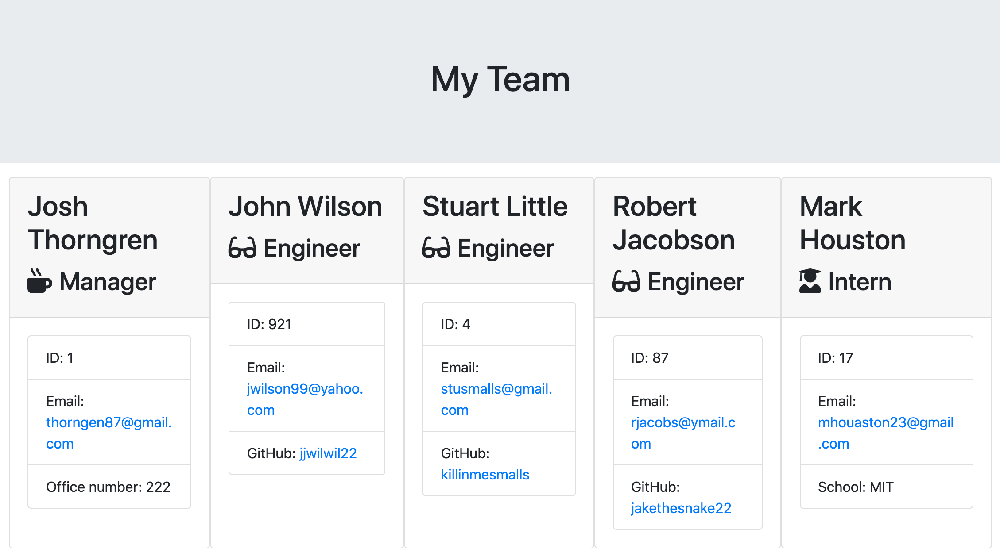

# Employee Summary

## Description
A simple Node CLI application that quickly generates a quality HTML UI detailing your work team!
## Sample README
https://github.com/josh8903/09-readme-generator/blob/master/generatedREADME.md

## Walk-through
https://drive.google.com/file/d/187qg7NQSln1854Wzbe7FeOnGvcdvUyIG/view
## Installation
1. Run this command to download the application
```
git clone git@github.com:josh8903/10-employee-summary.git
```
2. Run this command to navigate to the application folder
```
cd 10-employee-summary
```
3. Run this command to install dependencies
```
npm i
```
## Tests
1. Run this command to perform tests
```
npm test
```
## Usage
1. Run this command to start the application
```
node app
```
2. Respond to prompts to generate your README file!
3. Once you have responded to all of the prompts, you will find a file titled `"team.html"` in the output folder located in the same directory as the application. This is your HTML team page - enjoy!

## Questions
If you have any questions, please feel free to [e-mail](mailto:thorngren87@gmail.com) me!        
Check out my [GitHub](https://github.com/Josh8903/) to see more of my work!
